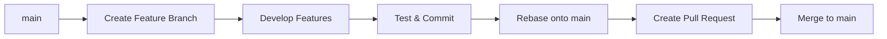

# Git Commands Cheat Sheet and Workflow Guide

[](https://git-scm.com/)

Git is a powerful distributed version control system used by developers to manage code history, collaborate on software projects, automate workflows, and maintain clean, versioned codebases. This documentation offers an in-depth guide to foundational and advanced Git commands, GUI integrations, GitHub CLI usage, workflow automation with GitHub Actions, and includes diagrams for visual learners. It is designed as a README.md for easy consumption and navigation.

---
## 1. Setup & Configuration
Configure your Git identity, default editor, and preferences before starting any project. Essential for attributing work correctly and personalizing your environment.

```bash
# Set identity (First commit)
git config --global user.name "Alex Johnson"
git config --global user.email "alex@example.com"

# Set default editor
git config --global core.editor "code --wait"

# Enable color output
git config --global color.ui auto
```
## 2. Repository Initialization
#### Create or clone a repository.

Create a new repository or clone an existing one. Initialization sets up Git tracking in your project directory, while cloning copies a remote repository including its history.
```bash
# Initialize new repo
git init  # Initial commit

# Clone existing repo
git clone https://github.com/user/repo.git  # Clones with origin remote
```
## 3. Staging & Committing Changes
#### Track changes and create commits
Track file changes through staging (git add) and create permanent snapshots with commits. Commits should be atomic and include descriptive messages for clear history.
```bash
# Check current status
 git status
# Stage changes
git add file.txt # single
file git add . # all changes
# Commit staged snapshot
git commit -m "Describe change"
# Amend last commit (message or content)
git commit --amend -m "Updated message"
```
## 4. Branching
Create isolated environments for features, experiments, or bug fixes. Branches prevent conflicts in main codebase and enable parallel development.

```bash
# Create and switch to new feature branch
git checkout -b auth-feature  # Branch creation commit

# List all local branches (asterisk shows current)
git branch

# Switch between branches
git checkout main  # Switch to primary branch

# Delete merged branch (cleanup after completion)
git branch -d old-feature  # Cleanup commit
```
## 5. Merging & Rebasing
Integrate changes between branches. Merging preserves history as-is, while rebasing creates linear history by replaying commits.

```bash
# Merge feature branch into main
git checkout main
git merge auth-feature -m "Integrate authentication system"

# Rebase feature branch onto latest main
git checkout auth-feature
git rebase main  # Commit: "Rebase auth feature"

# Resolve conflicts during rebase/merge
git mergetool  # Use configured diff tool

```
### Visual Workflow Diagram


## 6. Sharing & Updating Projects
Synchronize local work with remote repositories. Essential for collaboration, code sharing, and backup.

```bash
# Add remote repository
git remote add origin https://github.com/user/project.git

# Push local branch to remote
git push -u origin main  # First push: "Initialize remote"

# Fetch changes from remote without merging
git fetch origin

# Pull latest changes and merge
git pull origin main  # Commit: "Sync with main"

# Add upstream repository for forked projects
git remote add upstream https://github.com/original/repo.git
git fetch upstream
git merge upstream/main
```
## 7. Undoing Changes
Correct mistakes in staging area or working directory. Revert commits safely or reset history when necessary.

``` bash
# Unstage file without losing changes
git reset HEAD config.yml  # After accidental add

# Discard local changes to file
git checkout -- broken-file.js

# Create new commit that reverses previous commit
git revert c1a2b3d -m "Revert experimental feature"

# Reset branch to specific commit (use with caution!)
git reset --hard ab12cd3  # Commit: "Hard reset to stable version"

```
## 8. Viewing History
Inspect commit history, compare changes, and track file evolution. Essential for debugging and understanding project evolution.

``` bash
# Show compact commit history with graph
git log --oneline --graph --decorate --all

# View changes in specific commit
git show ab12cd3

# See line-by-line file history
git blame README.md

# Compare differences between branches
git diff feature..main
```
## 9. Stashing
Temporarily shelve uncommitted changes to switch contexts. Ideal when you need to quickly jump between tasks without committing WIP.

``` bash
# Stash current changes with message
git stash push -m "WIP: search implementation"

# List available stashes
git stash list

# Apply most recent stash and keep in stack
git stash apply

# Apply specific stash and remove from stack
git stash pop stash@{1}

# Clear stash entries
git stash drop stash@{0}

```
