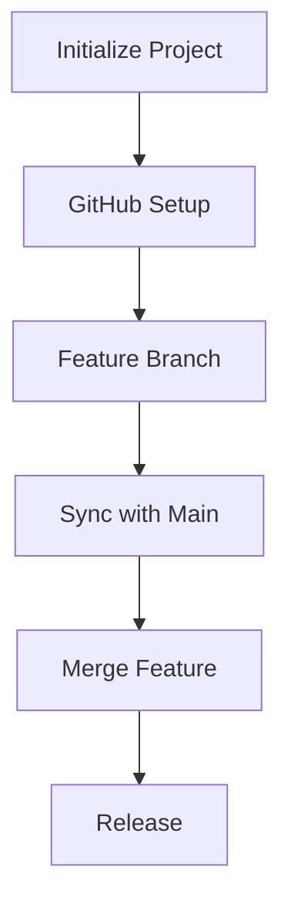

# Git Commands Cheat Sheet and Workflow Guide

[](https://git-scm.com/)

Git is a powerful distributed version control system used by developers to manage code history, collaborate on software projects, automate workflows, and maintain clean, versioned codebases. This documentation offers an in-depth guide to foundational and advanced Git commands, GUI integrations, GitHub CLI usage, workflow automation with GitHub Actions, and includes diagrams for visual learners. It is designed as a README.md for easy consumption and navigation.

---
## 1. Setup & Configuration
Configure your Git identity, default editor, and preferences before starting any project. Essential for attributing work correctly and personalizing your environment.

```bash
# Set identity (First commit)
git config --global user.name "Alex Johnson"
git config --global user.email "alex@example.com"

# Set default editor
git config --global core.editor "code --wait"

# Enable color output
git config --global color.ui auto
```
## 2. Repository Initialization
#### Create or clone a repository.

Create a new repository or clone an existing one. Initialization sets up Git tracking in your project directory, while cloning copies a remote repository including its history.
```bash
# Initialize new repo
git init  # Initial commit

# Clone existing repo
git clone https://github.com/user/repo.git  # Clones with origin remote
```
## 3. Staging & Committing Changes
#### Track changes and create commits
Track file changes through staging (git add) and create permanent snapshots with commits. Commits should be atomic and include descriptive messages for clear history.
```bash
# Check current status
 git status
# Stage changes
git add file.txt # single
file git add . # all changes
# Commit staged snapshot
git commit -m "Describe change"
# Amend last commit (message or content)
git commit --amend -m "Updated message"
```
## 4. Branching
Create isolated environments for features, experiments, or bug fixes. Branches prevent conflicts in main codebase and enable parallel development.

```bash
# Create and switch to new feature branch
git checkout -b auth-feature  # Branch creation commit

# List all local branches (asterisk shows current)
git branch

# Switch between branches
git checkout main  # Switch to primary branch

# Delete merged branch (cleanup after completion)
git branch -d old-feature  # Cleanup commit
```
## 5. Merging & Rebasing
Integrate changes between branches. Merging preserves history as-is, while rebasing creates linear history by replaying commits.

```bash
# Merge feature branch into main
git checkout main
git merge auth-feature -m "Integrate authentication system"

# Rebase feature branch onto latest main
git checkout auth-feature
git rebase main  # Commit: "Rebase auth feature"

# Resolve conflicts during rebase/merge
git mergetool  # Use configured diff tool

```
### Visual Workflow Diagram


## 6. Sharing & Updating Projects
Synchronize local work with remote repositories. Essential for collaboration, code sharing, and backup.

```bash
# Add remote repository
git remote add origin https://github.com/user/project.git

# Push local branch to remote
git push -u origin main  # First push: "Initialize remote"

# Fetch changes from remote without merging
git fetch origin

# Pull latest changes and merge
git pull origin main  # Commit: "Sync with main"

# Add upstream repository for forked projects
git remote add upstream https://github.com/original/repo.git
git fetch upstream
git merge upstream/main
```
## 7. Undoing Changes
Correct mistakes in staging area or working directory. Revert commits safely or reset history when necessary.

``` bash
# Unstage file without losing changes
git reset HEAD config.yml  # After accidental add

# Discard local changes to file
git checkout -- broken-file.js

# Create new commit that reverses previous commit
git revert c1a2b3d -m "Revert experimental feature"

# Reset branch to specific commit (use with caution!)
git reset --hard ab12cd3  # Commit: "Hard reset to stable version"

```
## 8. Viewing History
Inspect commit history, compare changes, and track file evolution. Essential for debugging and understanding project evolution.

``` bash
# Show compact commit history with graph
git log --oneline --graph --decorate --all

# View changes in specific commit
git show ab12cd3

# See line-by-line file history
git blame README.md

# Compare differences between branches
git diff feature..main
```
## 9. Stashing
Temporarily shelve uncommitted changes to switch contexts. Ideal when you need to quickly jump between tasks without committing WIP.

``` bash
# Stash current changes with message
git stash push -m "WIP: search implementation"

# List available stashes
git stash list

# Apply most recent stash and keep in stack
git stash apply

# Apply specific stash and remove from stack
git stash pop stash@{1}

# Clear stash entries
git stash drop stash@{0}

```
## 10. Tagging
Mark specific points in history as important (typically releases). Annotated tags store extra metadata and are recommended for versioning.

``` bash
# Create lightweight tag
git tag v1.2.0-beta

# Create annotated tag with message
git tag -a v1.2.0 -m "Production release 2023"

# Push tags to remote repository
git push origin --tags  # Share tags with team

# List all tags
git tag -l
```
## 11. Git GUI Tools Integration

Visual interfaces enhance Git operations by providing intuitive representations of repository history, simplifying complex workflows, and reducing command-line dependency. Ideal for beginners, visual learners, and teams adopting standardized workflows.

### Popular Tools Comparison

| Tool | Platform | Best For | Key Features | Download |
|------|----------|----------|--------------|----------|
| **GitKraken** | Win/Mac/Linux | **Visual History** | Interactive graph, drag-and-drop merging, Jira integration | [gitkraken.com](https://www.gitkraken.com/) |
| **Sourcetree** | Win/Mac | **Branch Management** | Free, built-in Git-flow, file history | [sourcetreeapp.com](https://www.sourcetreeapp.com/) |
| **GitHub Desktop** | Win/Mac | **GitHub Users** | Simplified PR workflow, CI status integration | [desktop.github.com](https://desktop.github.com/) |
| **VS Code GitLens** | Cross-platform | **Developers** | Inline blame, code lens, commit search | [GitLens Extension](https://marketplace.visualstudio.com/items?itemName=eamodio.gitlens) |

### Core Features Across Tools
- **Visual Commit Graphs**: See branch relationships and merge history
- **Single-Click Operations**: Stage, commit, push with intuitive buttons
- **Conflict Resolution**: Side-by-side diff tools with merge helpers
- **Repository Insights**: Contributor stats and file history timelines
- **Integration Ecosystem**: Jira, GitHub Issues, Trello, CI platforms

### GUI Workflow Diagram

### GitHub Desktop Workflow
1. Initialize Repository<br>
→ Path: File → New Repository → Add local path<br>
→ Visual Cue: Repository dashboard appears

2. Branch Creation <br>
→ Path: Branch → New Branch → Name: feature-auth<br>
→ Visual Cue: Branch selector updates

3. Stage Changes<br>
→ Action: Check files to stage<br>
→ Visual Cue: Files move to "Staged Changes"<br>
→ Commit: Type message below

4. Commit & Push<br>
→ Action: Commit to branch → Push origin<br>
→ Visual Cue: Push notification appears

5. Create Pull Request<br>
→ Path: Branch → Create Pull Request<br>
→ Result: Opens GitHub PR page

6. Resolve Conflicts<br>
→ Trigger: Automatic detection<br>
→ Action: Resolve Conflicts → Choose changes

### Keyboard Shortcuts
| Action          | GitKraken      | Sourcetree     | GitHub Desktop |
|-----------------|----------------|----------------|----------------|
| **Stage All**   | `Space`        | `⌘+A`          | `⌘+Shift+A`    |
| **Commit**      | `Ctrl+Enter`   | `⌘+C`          | `⌘+Enter`      |
| **Push**        | `Ctrl+P`       | `⌘+P`          | `⌘+P`          |
| **Pull**        | `Ctrl+Shift+P` | `⌘+Shift+P`    | `⌘+Shift+P`    |
| **Branch View** | `L`            | `⌘+3`          | `⌘+B`          |

### GUI vs CLI Guide
| Scenario               | Recommended Tool        |
|------------------------|-------------------------|
| **History Visualization** | GitKraken/GitLens    |
| **Complex Merges**     | Sourcetree/VS Code      |
| **Quick Commits**      | GitHub Desktop          |
| **Advanced Operations**| CLI + GitKraken         |
| **Automation**         | CLI + GitHub Actions    |

Pro Tips <br>
▶️ Learn CLI Through GUI <br>
Most tools show equivalent CLI commands for actions

▶️ Keyboard Navigation <br>

GitKraken: Press ? for shortcut cheatsheet

Sourcetree: ⌘+1 (Workspace), ⌘+2 (History)

▶️ Customize Views
```bash
# GitKraken: Preferences → UI Themes → Dark Mode
# Sourcetree: View → File Status Log
```
▶️ Conflict Resolution

1. Launch merge tool from notification

2. Compare changes side-by-side

3. Select changes with radio buttons

4. Save and mark resolved

▶️ Editor Integration

VS Code: GitLens + GitHub Pull Requests

IntelliJ: Built-in Git (VCS menu)

Expert Insight: "GUI tools lower the learning curve for newcomers while providing powerful visualization for veterans. The best teams combine CLI efficiency with GUI clarity." - Linus Torvalds
## 12. GitHub CLI Commands
Manage GitHub repositories and workflows directly from terminal. Streamlines issue tracking, PR management, and repository operations.

```bash
# Authenticate with GitHub
gh auth login

# Create new repository
gh repo create new-project --public --clone

# Create issue with labels
gh issue create --title "Bug: Login Failure" --body "Steps to reproduce..." --label "bug"

# Create pull request
gh pr create --base main --head feature-x --title "New API endpoints" --body "Implements user management"

# Merge pull request with squash
gh pr merge 123 --squash -m "Implement user API"

# View open pull requests
gh pr list
```
## 13. Advanced Techniques
Professional workflows for complex scenarios including selective commits, history rewriting, and debugging.

``` bash
# Cherry-pick specific commit to current branch
git cherry-pick d4e5f6a  # Commit: "Apply security patch"

# Interactive rebase (last 4 commits)
git rebase -i HEAD~4
# Options: squash, reword, edit, drop

# Binary search to find bug introduction
git bisect start
git bisect bad         # Current version has bug
git bisect good v1.0   # Last known good version
# Test and mark commits until found

# Custom pre-commit hook (run tests)
#!/bin/sh
npm test || exit 1
```
## 14. GitHub Actions & CI/CD
Automate testing, building, and deployment workflows. Runs on GitHub's infrastructure triggered by repository events.

Sample CI Pipeline (.github/workflows/ci.yml):

```yaml
name: Continuous Integration
on: [push, pull_request]

jobs:
  test:
    runs-on: ubuntu-latest
    steps:
    - name: Checkout code
      uses: actions/checkout@v3
      
    - name: Setup Node
      uses: actions/setup-node@v3
      with:
        node-version: '18'
        
    - name: Install dependencies
      run: npm ci
      
    - name: Run tests
      run: npm test
      
  deploy:
    needs: test
    runs-on: ubuntu-latest
    if: github.ref == 'refs/heads/main'
    steps:
    - uses: actions/checkout@v3
    - run: ./deploy.sh
```
## 15. Real Example Workflow: Payment Feature Implementation

This end-to-end workflow demonstrates professional Git practices from project initialization to production release. We will implement a payment feature using branch isolation, rebase synchronization, explicit merge commits, and semantic versioning.

### Workflow Overview
1. **Initialize Project** → Create local repository  
2. **GitHub Setup** → Connect to remote  
3. **Feature Branch** → Develop in isolation  
4. **Sync with Main** → Rebase to update  
5. **Merge Feature** → Integrate with main  
6. **Release** → Tag and publish
   
### Visual Workflow

## Step-by-Step Explanation
#### 1. Project Initialization
``` bash
mkdir my-project && cd my-project
git init
echo "# Payment System" > README.md
git add .
git commit -m "chore: initialize repository"
Creates foundation with first commit and basic documentation.
```
#### 2. GitHub Repository Setup
```bash
gh repo create my-project --public --source=. --remote=origin
git push -u origin main
Connects local repo to GitHub and sets up tracking. Requires GitHub CLI.
```
#### 3. Feature Development
``` bash
git checkout -b payment-feature
touch payment.js
git add payment.js
git commit -m "feat: add payment processing core"
```
Isolates work in a dedicated branch following feature branch workflow.

#### 4. Synchronize with Main
```bash
git checkout main
git pull origin main
git checkout payment-feature
git rebase main
```
Updates feature branch with latest main changes. If conflicts:

▶️ Resolve in files

▶️ git add <file>

▶️ git rebase --continue

#### 5. Merge to Main
```bash
git checkout main
git merge --no-ff payment-feature -m "feat: release payment system v1"
git push origin main
```
Preserves feature history with explicit merge commit (--no-ff flag).
#### 6. Version Release
``` bash
git tag -a v2.0.0 -m "Payment gateway integration"
git push origin --tags
gh release create v2.0.0 --generate-notes
```
Tags production release and creates GitHub release with auto-generated notes.

## Command Sequence Cheat Sheet
```bash
# 1. Initialize
mkdir project && cd project
git init
echo "# Project" > README.md
git add . && git commit -m "Initial commit"

# 2. GitHub Setup
gh repo create project --public --source=. --remote=origin
git push -u origin main

# 3. Feature Work
git checkout -b new-feature
# ... make changes ...
git add . && git commit -m "feat: add new feature"

# 4. Sync Updates
git checkout main
git pull origin main
git checkout new-feature
git rebase main

# 5. Merge Feature
git checkout main
git merge --no-ff new-feature -m "Release feature"
git push origin main

# 6. Release
git tag -a v1.0.0 -m "Production release"
git push origin --tags
gh release create v1.0.0 --generate-notes
```
### Key Takeaways
| Principle             | Implementation          | Benefit                      |
|-----------------------|-------------------------|------------------------------|
| **Branch Isolation**  | `git checkout -b feature` | Prevents main branch pollution |
| **Frequent Sync**     | `git rebase main`       | Reduces merge conflicts       |
| **Explicit Merges**   | `git merge --no-ff`     | Preserves feature context     |
| **Semantic Versioning** | `git tag -a v1.0.0`     | Clear release points          |
| **Automation**        | `gh release create`     | Streamlined publishing        |

### Pro Tips

<table>
  <tr>
    <td width="30%"><strong>🛡️ Conflict Prevention</strong></td>
    <td>Rebase feature branches daily with <code>git rebase main</code> to prevent large merge conflicts</td>
  </tr>
  <tr>
    <td><strong>📝 Commit Hygiene</strong></td>
    <td>Follow <a href="https://www.conventionalcommits.org/">conventional commits</a> for standardized messages:<br>
    <code>fix: resolve payment validation error</code><br>
    <code>feat: add currency conversion</code></td>
  </tr>
  <tr>
    <td><strong>🧹 Branch Cleanup</strong></td>
    <td>Delete merged branches to keep repository tidy:
     
```bash
# Delete local branch
git branch -d payment-feature

# Delete remote branch
git push origin --delete payment-feature

```
</td> </tr> <tr> <td><strong>🤖 Release Automation</strong></td> <td>Use flags for polished releases:
 
 ```bash 
 gh release create v2.0.0 --latest --generate-notes 
 ```

 <em>--latest</em> marks as newest release</td> </tr> <tr> <td><strong>🔍 Verify Tags</strong></td> <td>Inspect tag details before deployment:
 
 ```bash 
 git show v2.0.0
 ``` 
 
 Checks tag message, author, and date</td> </tr> </table>

This workflow balances individual productivity with team coordination. The rebase-merge approach maintains linear history while preserving feature context.

---

## 👥 Contributors

<a href="https://github.com/secbyteX03">
  
</a>

Made with [contrib.rocks](https://contrib.rocks).

Special thanks to:
- [Magret Faith](https://github.com/MagretFaith) - Project maintainer

---

## 📜 License 

[](https://opensource.org/licenses/MIT)
[](https://github.com/yourusername/yourrepository/blob/main/LICENSE)

This documentation and all code samples are licensed under the MIT License - see the [LICENSE](LICENSE) file for details.

Permissions include:
- Commercial use
- Modification
- Distribution
- Private use

Limitations:
- Liability
- Warranty
